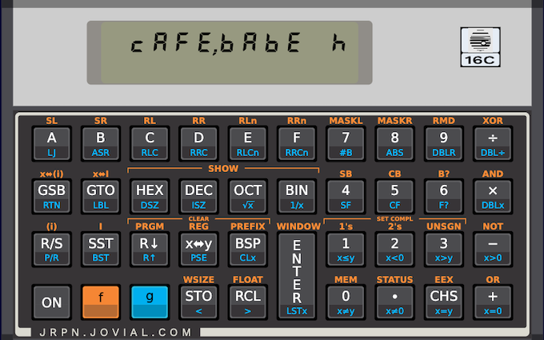
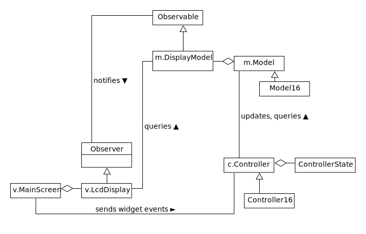

# JRPN

JRPN is a a pair of clean-room calculator simulators,
inspired by the HP-16C and HP-15C.  The main entry
points are in `jrpn15/lib/main.dart` and
`jrpn16/lib/main.dart`.
It uses a simulated seven-segment LCD for display, and
generally tries to remain faithful to the look-and-feel
of a real calculator.

See https://jrpn.jovial.com/ for more about the calculators'
features.

## Design

The design is a pretty has a pretty strict MVC separation.
Notably, the model doesn't have API dependencies on the
view or the controller.  It uses the classical MVC structure,
often imprecisely pictured like this:

There are even top-level classes called `m.Model` and `c.Controller`.
They're abstract; for the 16C the concrete subclasses are `Model16`
and `Controller16`.  The top-level widget is `Jrpn`, but the real
top-level view class is called `MainScreen`.  `c.Controller` does
*not* update the view directly.  A more precise top-level structure
in UML is as follows:

The input state models of the 16C and especially the 15C 
are pretty complicated -- they really
made the most out of a small package!  This complexity is managed
though extensive use of the GoF state pattern, especially in
`controller` and `controller.states`.  The controller uses the
command pattern to manage the complexity of the operations.
Check out `controller.operations` for details.

The LCD display is created using some trig.  The drawings where I
worked this out are fun -- see `Segments` under `view.lcd_display`.

As a general statement, I tried to provide good overviews, and
design documentation.  I find that this helps me to refine the
design and spot problems, but I this case I thought there might
be some value in using this project as a sort of design clinic.
It's a good size for that:  At about 10K LOC it's big enough to
have an interesting design, but not so big as to be overwhelming.
It ends up using a fair number of OO design idioms, and it's pretty
faithful to the standard GoF patterns.  

This app pushes the Dart type system a bit -- Dart's (mostly) 
sound static typing was a big help in getting the code right, 
but it did expose one place where Dart's unsound covariance 
rules hurt some.  See `DisplayModeSelector` under `model`
for more details on that.

In some places, the design is probably a little "too OO."  For
example, some of the selector usages obscure the code, and make
debugging harder, where perhaps a switch statement might have
been simpler/clearer.  In retrospect, maybe a few spots in the code
are a little too clever.

## Building

It's a little tricky to set up Flutter to build two applications from
one source base.  In the `jrpn` repo, the directories `jrpn15` and `jrpn16`
each contain a project that builds an executable.  Each references the base
directory as a "library."

For automated build environments (like the Canonical Snap Store for Linux),
it was easiest for me to make a skeletal repo for each application.  Those are
at https://github.com/zathras/jrpn15_build and 
https://github.com/zathras/jrpn16_build; each pulls in the main `jrpn` repo
as a dependency in the `pubspec.yaml`.
